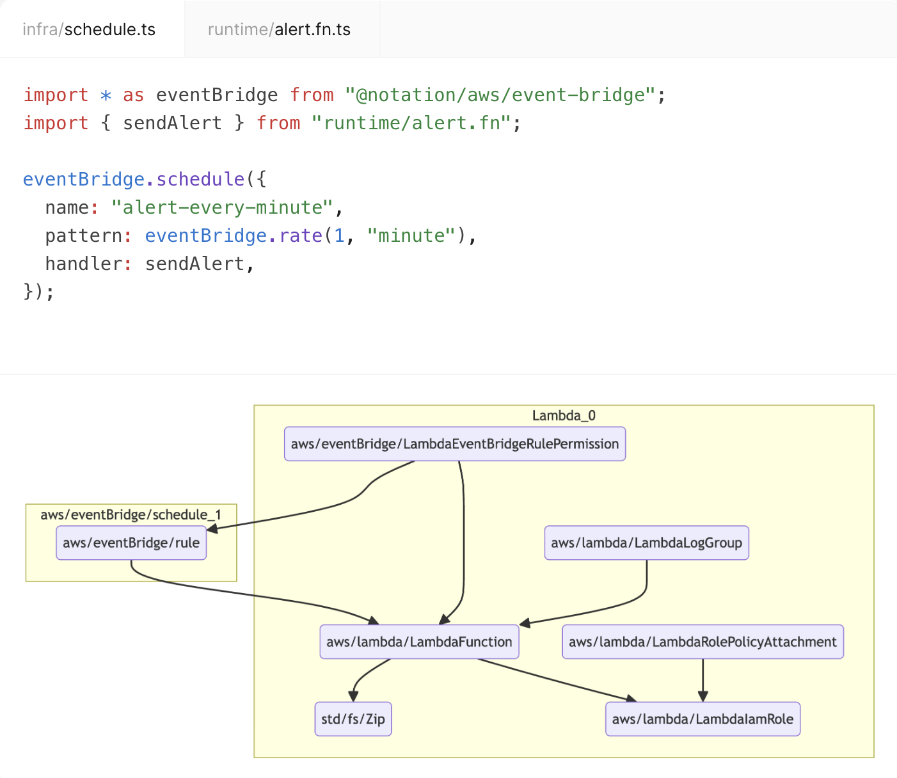
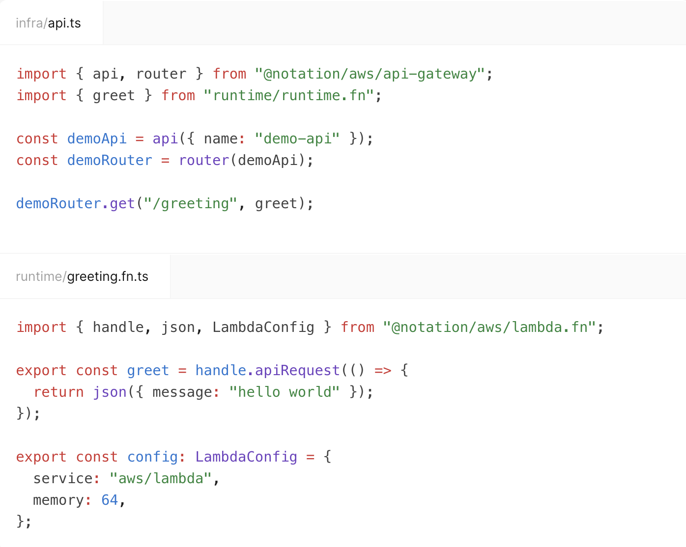
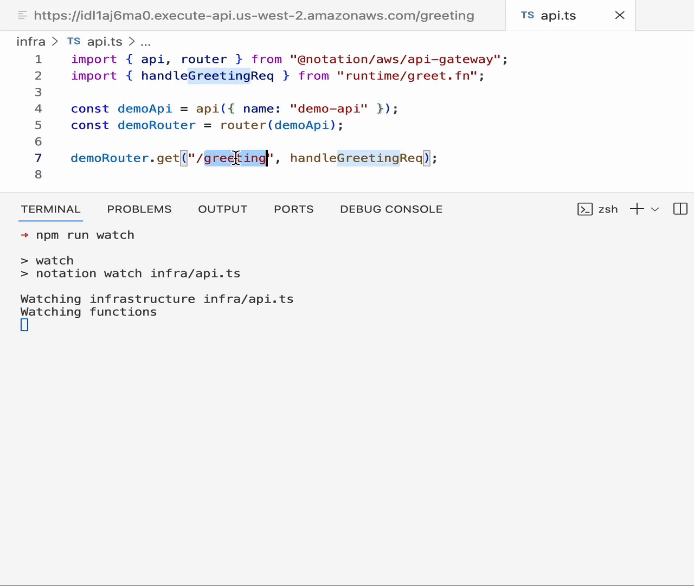
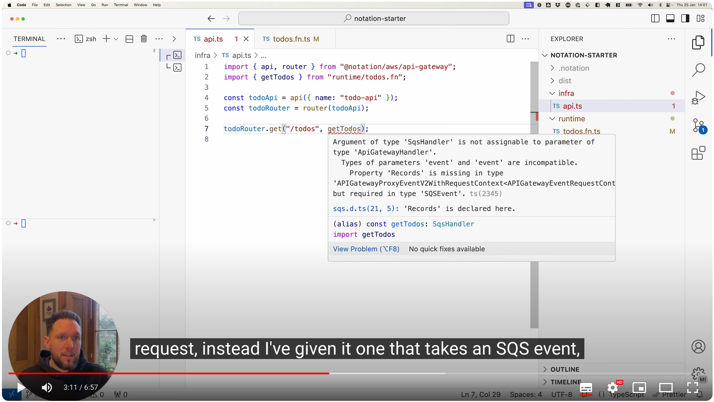

<br />

<p align="center">
  <a href="https://www.notation.dev">
    <picture>
      <source media="(prefers-color-scheme: dark)" srcset=".github/assets/notation-logo-dark.svg">
      <source media="(prefers-color-scheme: light)" srcset=".github/assets/notation-logo.svg">
      
    </picture>
  </a>
</p>

<p align="center">
  Notation is an open source infrastructure toolkit for building serverless applications.<br />It pairs scalable, managed services with a first-class developer experience.
</p>

<p align="center">
  <a href="https://www.notation.dev/docs/"></a>
  <a href="https://discord.gg/mGzDWShPzm"></a>
  <a href="https://github.com/notation-dev/notation/discussions"></a>
  <a href="https://twitter.com/intent/tweet?url=https://www.notation.dev"></a>
</p>

## Concepts

### 1. Inference

_A.k.a. Cloud Bureaucracy Compiler_

Cloud platforms are famously complicated. AWS was, after all, designed for Amazon – a massive corporation – not for small, nimble teams.

Should we just add an abstraction layer on top of the cloud platforms then? Not so fast.



Too much abstraction results in less powerful tools. We prefer instead to think about inference.

Take the example above: Notation infers – from the relationship between the lambda and the event bridge rule – all the required resources and cloud implementation details (e.g. valid ARN strings, JSON policy documents etc).

### 2. Cohesion

_A.k.a Infrastructure as LEGO_

In a modern serverless stack, your application code is composed of:

1. Code that defines infrastructure (provisioning code)
2. Code that runs on infrastructure (runtime code)

In practice, these concerns are tightly coupled. Both must work together as a cohesive unit.



Notation unifies runtime and infra modules within the same type space. That means if you try to connect two resources that are not compatible, the compiler will quickly let you know. Otherwise, everything slots into place, secured by well-designed types.

### 3. Iteration

_A.k.a. Hot Infra Swapping_

Most tools in this space are built on top of Terraform. Notation's IaC layer is built ambitiously from the ground up. This enables us to deliver faster development cycles.



With hot infra swapping, you can quickly spin up an ephemeral stack on production infrastructure, then watch it update in realtime as you code.

## Getting Started

Head over to [notation.dev](https://notation.dev) for documentation and guides, or dive right in:

```sh
npx create notation@alpha
```

## Demo

<a href="https://www.youtube.com/watch?v=dwS81CVkC88">

</a>

## Community

- [Discussions](https://github.com/notation-dev/notation/discussions): ask questions, give feedback on our RFCs, suggest ideas

- [Issues](https://github.com/notation-dev/notation/issues/new): report bugs,
  suggest new features, or help us improve the docs

- [Discord](https://discord.gg/mGzDWShPzm): ask for advice, share your projects,
  discuss contributions

## Questions and Feedback

Feel free to book a call to discuss Notation. We'd love to hear your feedback or answer any questions you have.

<a href="https://cal.com/djgrant/notation-chat"></a>

## License

[Apache 2.0](https://choosealicense.com/licenses/apache-2.0/)
