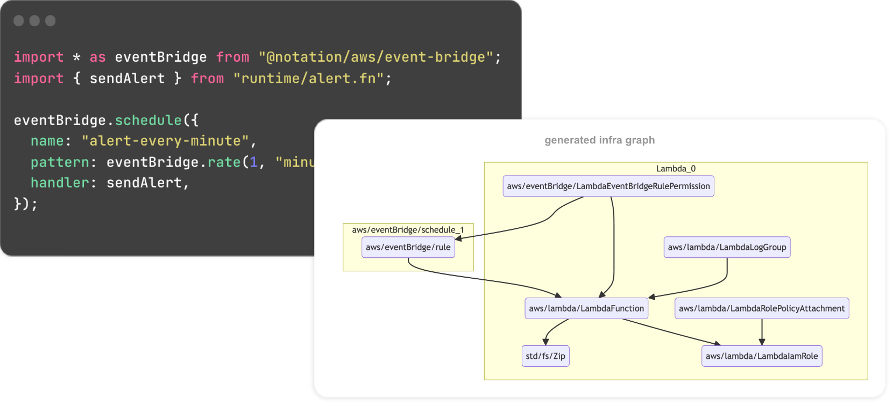

<h1>
  <a href="https://www.notation.dev">
    <picture>
      <source media="(prefers-color-scheme: dark)" srcset=".github/assets/notation-logo-dark.svg" height="40">
      <source media="(prefers-color-scheme: light)" srcset=".github/assets/notation-logo.svg" height="40">
      
    </picture>
  </a>    
  <br />
  <a href="https://github.com/notation_dev/notation/blob/main/LICENSE"></a>
  <a href="https://www.npmjs.com/package/@notation/core"></a>
  <a href="https://github.com/notation-dev/notation/discussions"></a>
  <a href="https://discord.gg/mGzDWShPzm"></a>
</h1>

[Website](https://notation.dev)<sup>↗</sup>&nbsp;•&nbsp;
[Quick Start](#quick-start)<sup>↓</sup>&nbsp;•&nbsp;
[Slow Start](https://notation.dev/docs/guide)<sup>↗</sup>&nbsp;•&nbsp;
[Examples](https://github.com/notation-dev/notation/tree/main/examples)&nbsp;•&nbsp;
[Discord](https://discord.gg/mGzDWShPzm)<sup>↗</sup>&nbsp;•&nbsp;
[Twitter](https://twitter.com/notation_dev)<sup>↗</sup>

<br />

**Notation is an open source toolkit for building serverless applications.**<br />
It pairs scalable, managed infrastructure with a first-class developer experience.

<br />



## What's in the toolkit?

Notation provides the following tools:

- **[Infrastructure Compiler](#-infrastructure-compiler)<sup>↓</sup>**: Production-ready infra, generated from application-like code
- **[Serverless Providers](#-serverless-providers)<sup>↓</sup>**: Popular serverless technologies, unified in a type-safe framework
- **[Cloud Provisioner](#-cloud-provisioner)<sup>↓</sup>**: Cross-platform deployments, with _hot infra replacement_ for local dev

## Quick Start

```sh
npm create notation@alpha my-app
```

See also: [Getting Started Guide](https://notation.dev/docs/guide)<sup>↗</sup>

## Demo

A walkthrough of the key features of Notation.

<a href="https://www.youtube.com/watch?v=dwS81CVkC88">

</a>

## Features

### 🤖 Infrastructure Compiler

- Generates cloud-specific implementation details
- Uses inference and best practices to compile policy documents, ARN strings, IAM roles, permissions etc.

### 🧩 Serverless Providers

- A selection of popular serverless resources – e.g. lambda, event bridge, API gateway
- Resources are fully-typed, making them easy to configure and connect to other resources
- Type checking even works between infrastructure and runtime modules

### 🚀 Cloud Provisioner

- Deploys production and ephemeral dev stacks
- Built from the ground up and designed for fast iteration cycles
- Hot infra replacement updates live dev stacks while you code

https://github.com/notation-dev/notation/assets/1670902/fd8c955f-8aa9-4800-813a-ea96c2b398cc

## Community

- **[Discussions](https://github.com/notation-dev/notation/discussions)**: ask questions, give feedback on RFCs, suggest ideas
- **[Issues](https://github.com/notation-dev/notation/issues/new)**: report bugs,
  suggest new features, or help us improve the docs
- **[Discord](https://discord.gg/mGzDWShPzm)<sup>↗</sup>**: ask for advice, share your projects,
  discuss contributions

## Questions and Feedback

Feel free to book a call to discuss Notation. We'd love to hear your feedback or answer any questions you have.

<a href="https://cal.com/djgrant/notation-chat"></a>

## License

[Apache 2.0](https://choosealicense.com/licenses/apache-2.0/)
